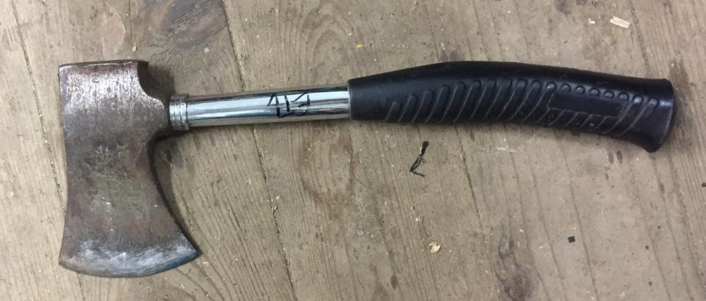
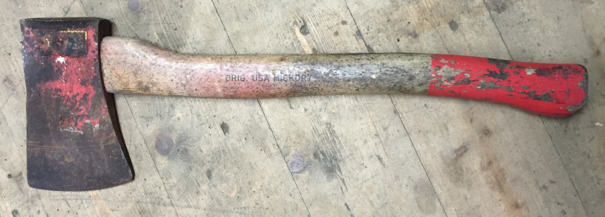
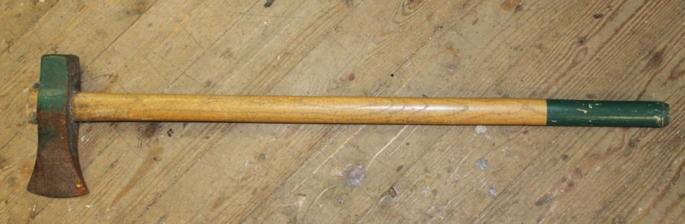
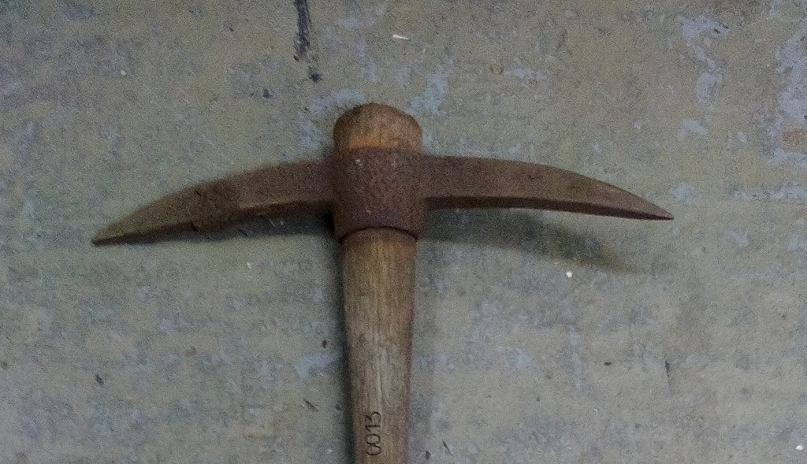
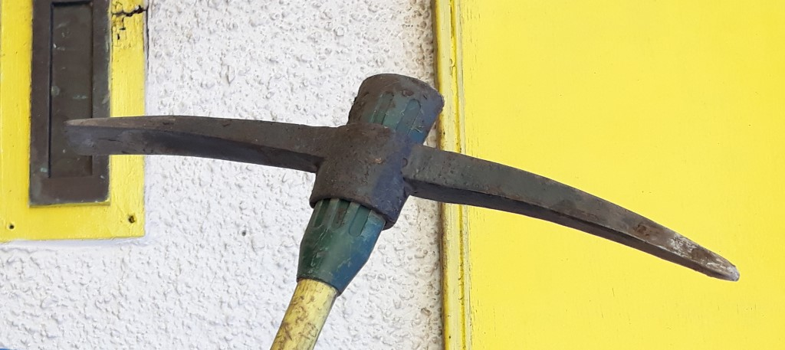
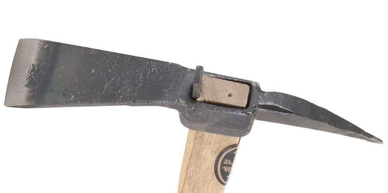
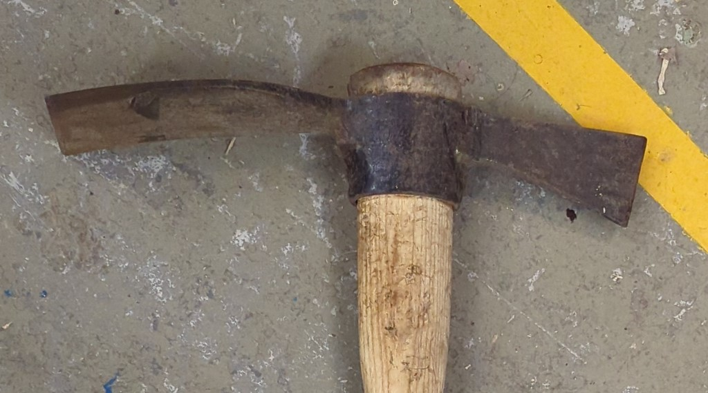
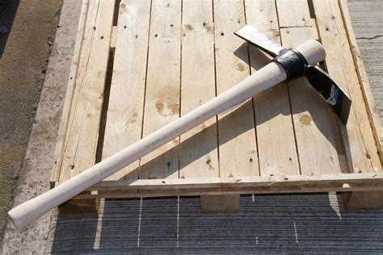

# Axes and Mattocks

[Home](README.md)

## Axes

An axe head is a blade running parallel to the shaft of the tool. The variations
are generally how many hands the item is intended to be used with.

A hatchet is intended to be used fully one handed, and will often have a curve to
the handle.

_Hatchet_

A hand axe will have a traditional axe head, and a longer straighter handle. Falling
somewhere between possible one and two handed use.

_Hand axe_

Two handed axes are definitely two hands only. This is still a "Hand Axe", just a big
one.

_Two handed axe_

## Mattocks and Picks

Axes, mattocks and picks are defined by the types of heads they have, either 
axe, adze or pick. 

### Pickaxes

A pickaxe has at least one pick.

_Pickaxe with two picks_

But might also have a thin chisel as well.

_Traditional pickaxe_

For extra points, if it has a pick and an axe head, it's a "Pickaxe axe"!

### Mattocks

If the chisel is instead shorter and wider, for digging, then it's called an adze 
and this is a "Mattock". If it still has a pick it is a "Pick Mattock".

_Pick mattock, with adze and pick sides_

If the pick is replaced with an axe, then it is a "Cutter Mattock".

If it's basically a cutter mattock, but absolutely huge, and only usable with
two hands it might be a "Grubber Mattock"

_Grubber mattock, or grubbing mattock_

