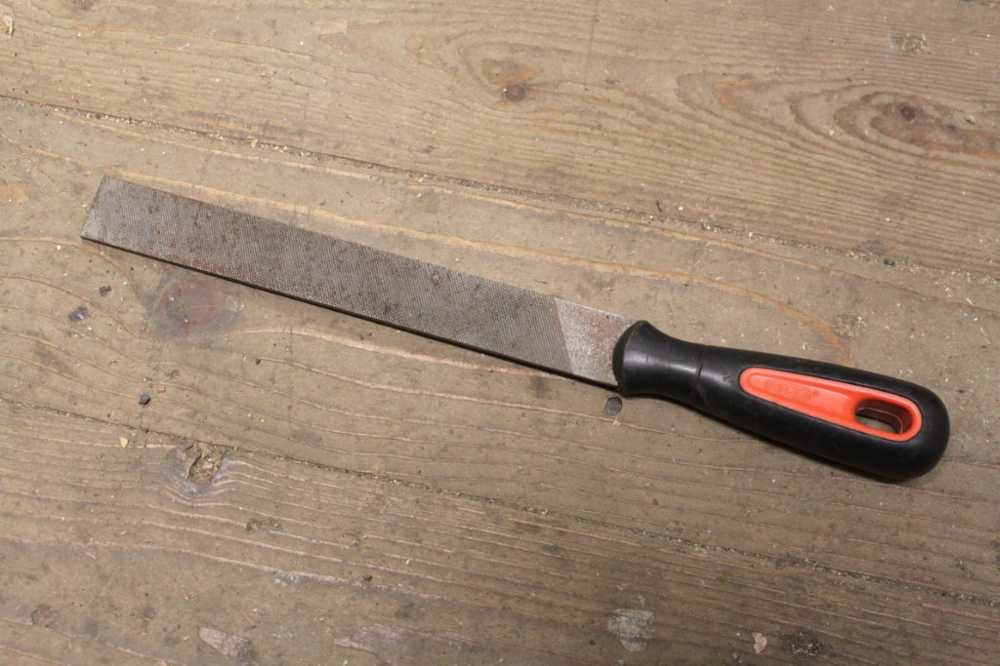
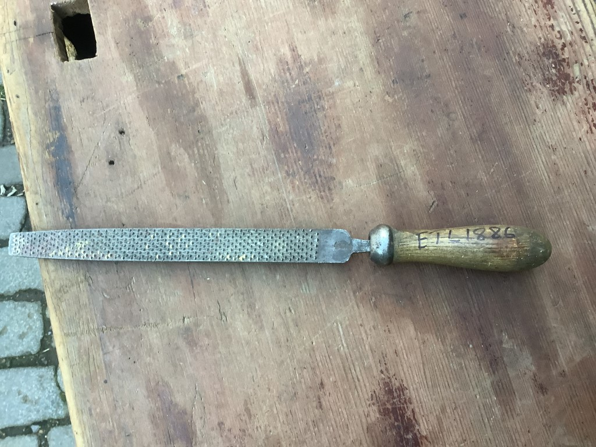
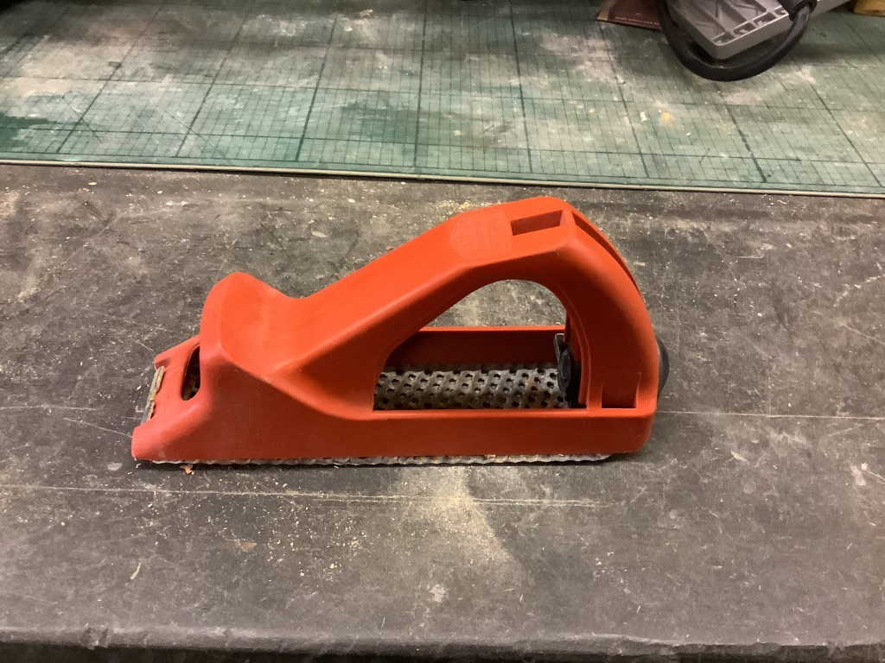

# Files

[Home](README.md)

## Files

Files come in all sorts of profiles (round, flat, square etc.), but are defined by 
fine abrasive texture on the surface.

_Flat file_

Generally it should be rough, but ok to run your finger down.

## Rasps

Rasps are much rougher, and have either sticky out teeth.

_Flat rasp_

...or a cheese grater like structure, and would not be pleasant to run your hand over.

_Surform rasp_

⚠️ Watch out - some of these can look a lot like planes, but are not.
