# Hammers and Mallets

[Home](index.md)

## Claw, Framing & Rip Hammers

The classic basic hammer is the "Claw hammer" with the curved claws for
removing nails at the back.

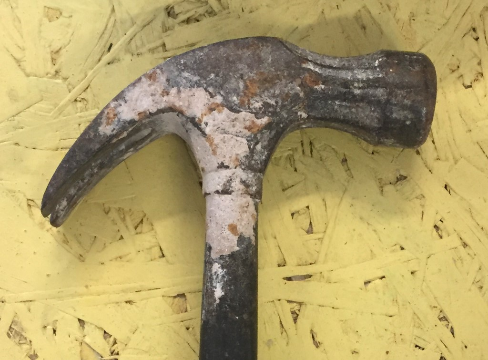

_Claw hammer_

A rip hammer is similar but with straighter claws, intended to also be used to pry boards 
apart.

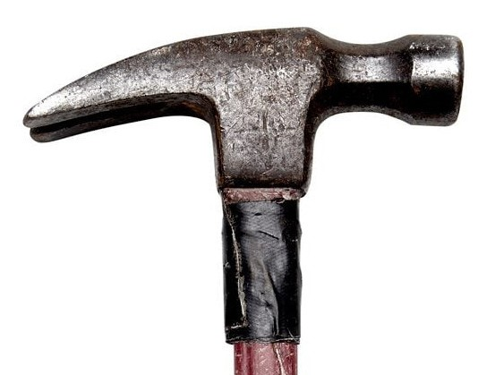

_Rip hammer_

A "Framing hammer" is like a rip hammer but larger and heavier  intended for construction, 
it is mostly used for putting nails in. Notice the waffled pattern on the striking face 
for it from skidding off of nails.

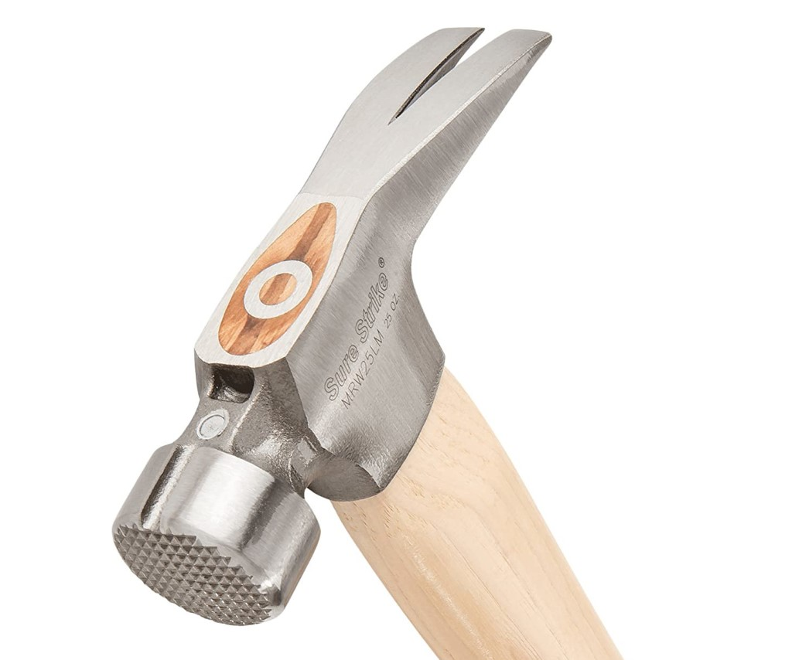

_Framing hammer_

## Tack, Cross-Peen Hammers

A modern tack hammer is intended for more detailed nailing work, and has a skinny head
or other features for working with nails.

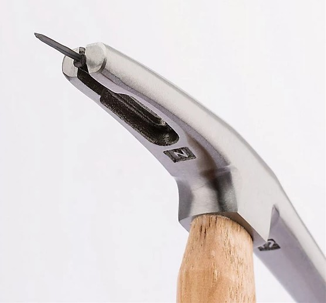

_Modern tack hammer with magnetic nail holder_

A cross-peen hammer has a horizontal wedge opposite to the flat striking face as you 
hold the tool straight up. They can be used for metal work or when thinner, more detailed
nailing work like cabinetry. Sometimes people will refer to these as a "Tack Hammer".

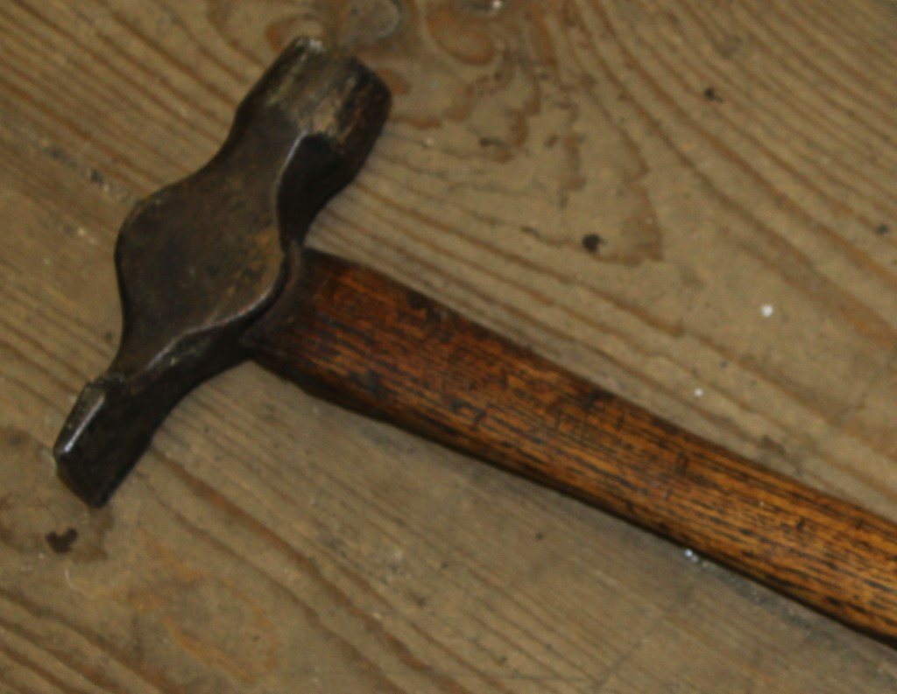

_Cross peen hammer_

There are various other types of tack hammers, which generally seem to be classified by
a skinny head and smaller size for more detailed work.

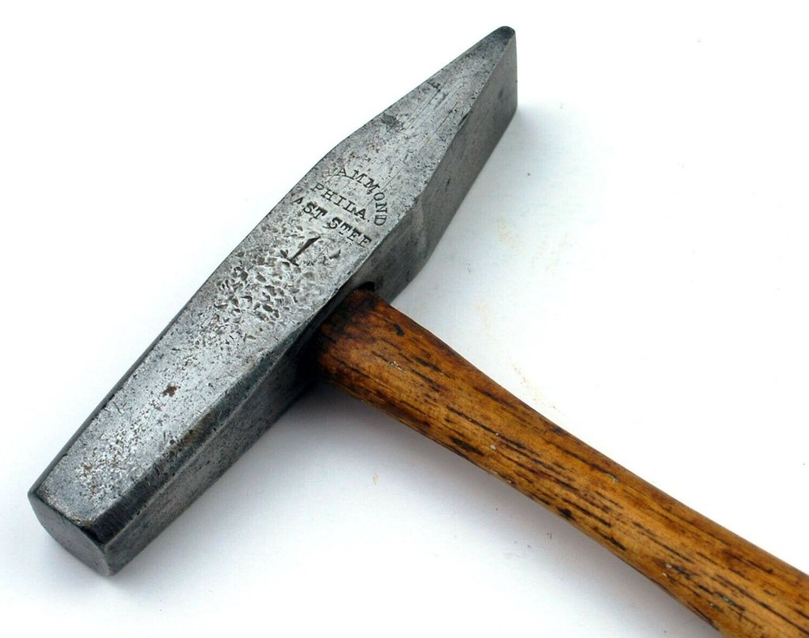

_Machinists cross peen hammer_

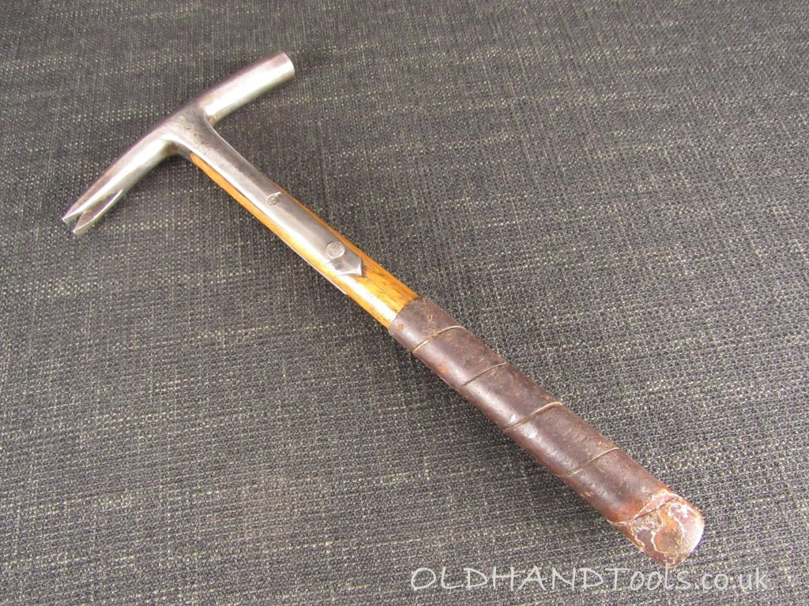

_Vintage tack claw hammer_

## Other Hammers

A ball-peen hammer has a ball opposite to the flat striking face. 

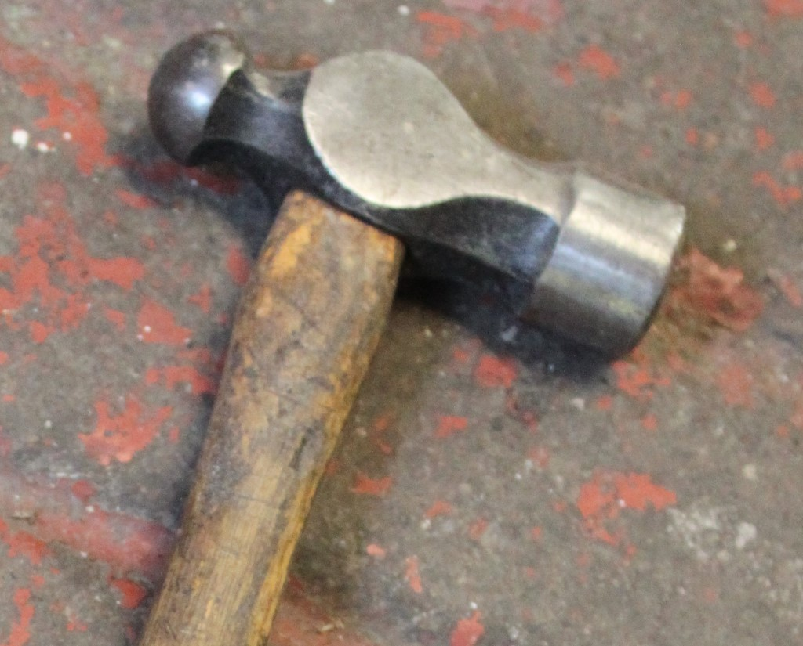

_Ball peen hammer_

A brick hammer (often confused with a lump or club hammer) has a horiztonal wedge
similar to a cross-peen hammer, but with a square striking face and is intended for
use with masonry.

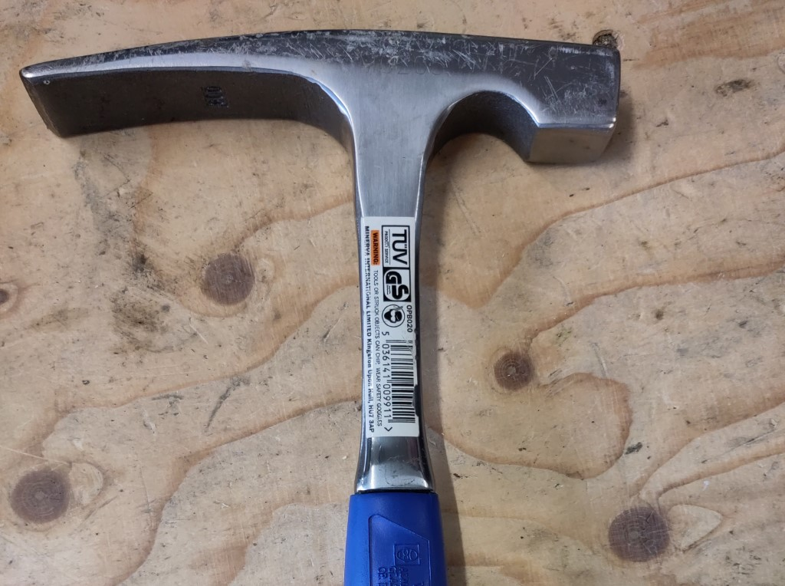

_Brick hammer_

## Sledge-hammers

The classic sledge hammer is huge, heavy and two handed.

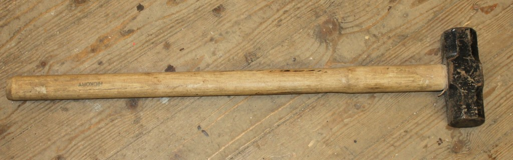

A one handed version for use on smaller items or tight spaces, is a "Club Hammer" or 
"Lump Hammer". It is not a brick hammer (see above).

_Sledge hammer_

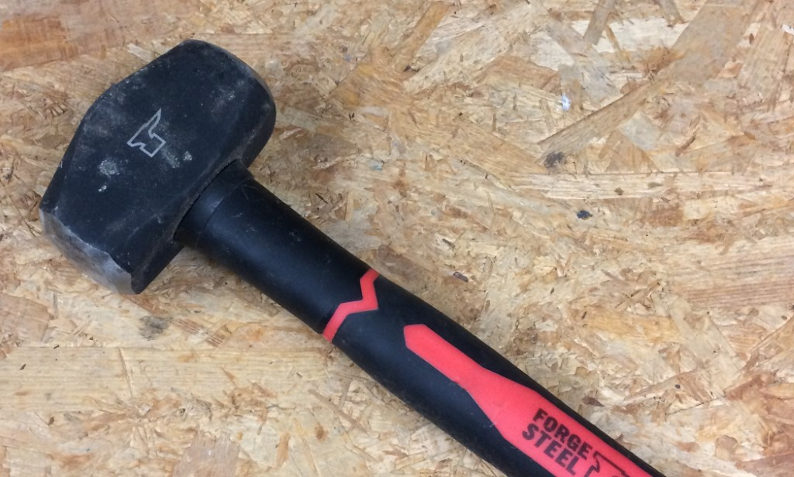

_Club hammer, or lump hammer_

## Mallets

Mallets generally are made of softer materials with larger faces, and typified
by the material used to strike.

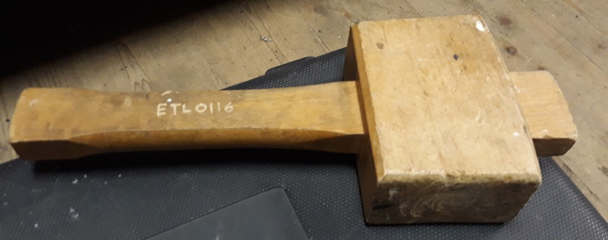

_Wooden mallet_

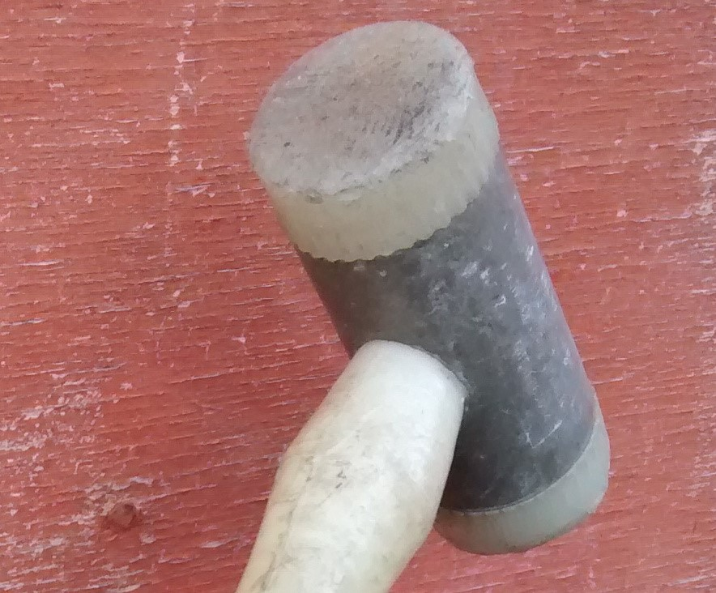

_Plastic tipped mallet_

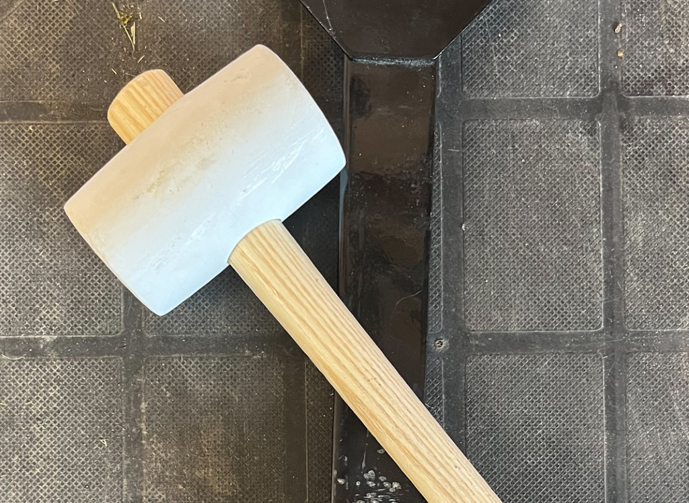

_Rubber mallet_
