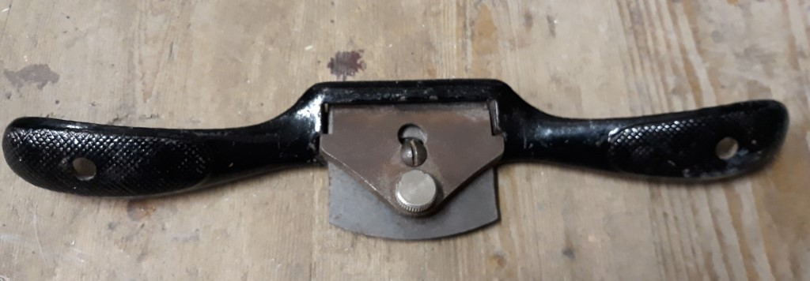

# Hand Planes

[Home](README.md)

## The basic 'plane'

The default here is a "Hand Plane". It might come in many different varieties,
but for our purposes if it doesn't fit into a special case, it's just a "Hand Plane".

_Metal hand plane_

_Wooden block plane_

## ⚠ Rogue rasps in disguise as planes ⚠

⚠️ Watch out for rasps in disguise as planers! Note the rasp teeth on the bottom
instead of a blade.

We would classify this as a "Rasp", depsite the stylings. 

_Planer rasp_

## Shoulder plane

Shoulder planes are much thinner than regular planes and are intended to run
along thin strips.

_Shoulder plane_

_Wooden shoulder plan_

## Rebate / rabbet planes

"Rebate Planes" are still quite skinny, but generally look a lot more complicated than 
shoulder planes and have a fence to hold them to the side of a piece.

_Rebate plane_

## Two-handed plane / spoke shave

A bit of an outlier is the "Two Handed Plane", also known as a spoke shave.

Most planes are used two handed, so this specifically refers to this kind of shaver.

_Two handed plane, or spoke shave_