# Hand saws

[Home](README.md)

## Bow saws

Bow saws have a flexible blade kept in tension with a bow, but come in lots
of different varieties.

At the bigger end we have the basic "Bow Saw", often used for garden work.

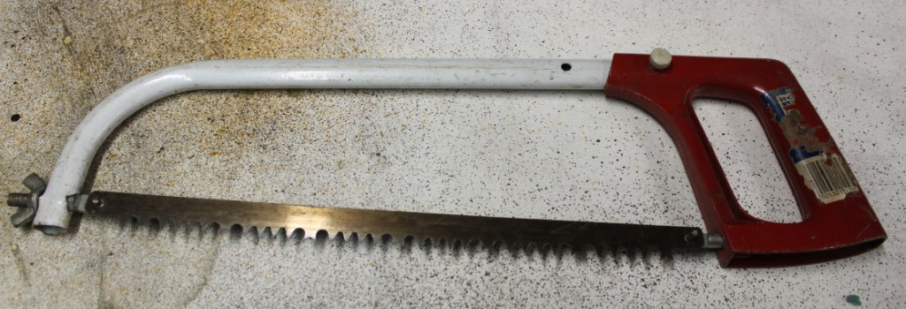

_Bow saw, tree saw or bush saw_

A hacksaw typically has a flat blade and very fine teeth, and can cut metal etc.

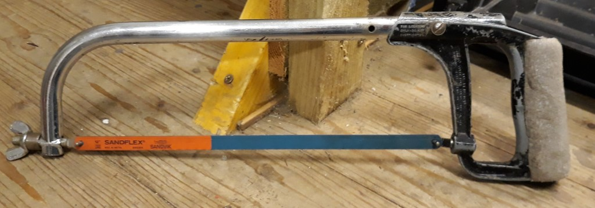

_Hack saw_

A dinky, one-handed hacksaw is a "Junior Hacksaw".

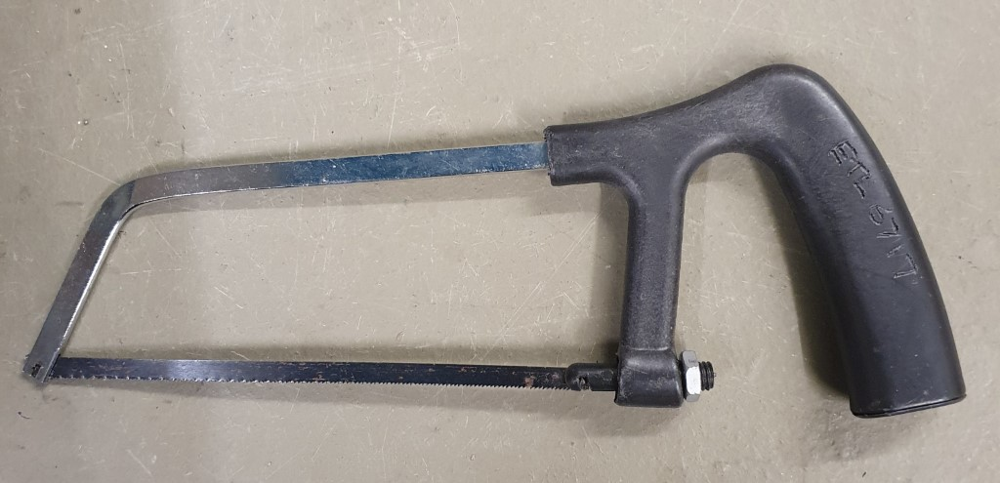

_Junior hacksaw_

This curious fellow is a hacksaw blade in a plastic holder, but is still
a "Hacksaw" for our purposes:

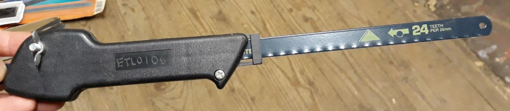

_Mini hacksaw_

If the blade is very fine it might be a "Coping Saw" intended for cutting 
complex shapes. Notice the handle in-line with the blade.

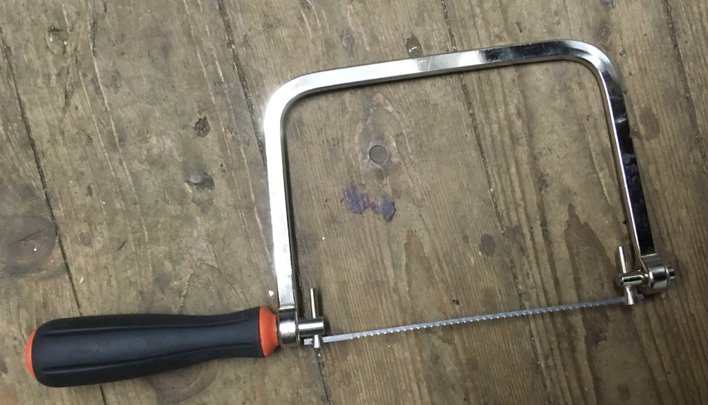

_Coping saw_

If the "blade" is instead a wire doped with abrasive compounds, it's probably a 
"Tile saw".

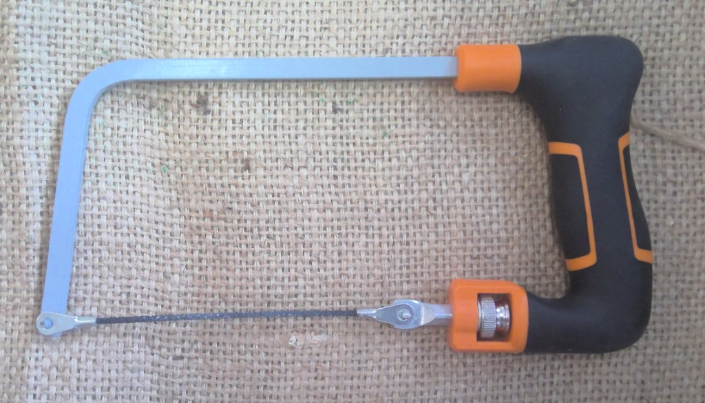

_Tile saw_

## Speciality saws

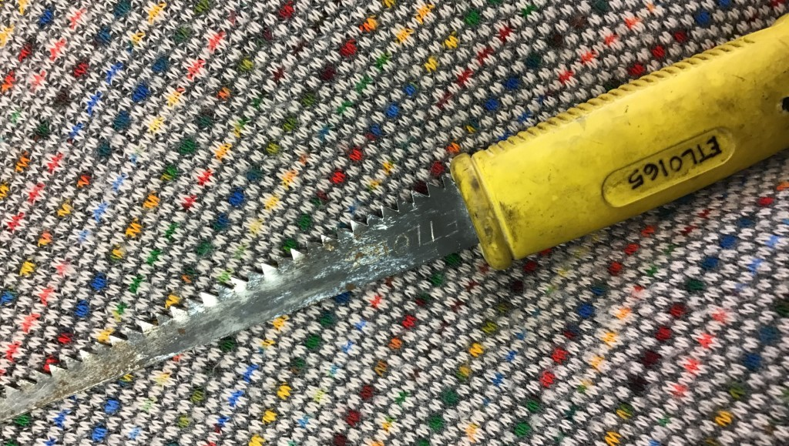

_Drywall saw_

An older variant of a drywall saw is a "Keyhole Saw", we'd probably classify 
this a dry-wall saw too.

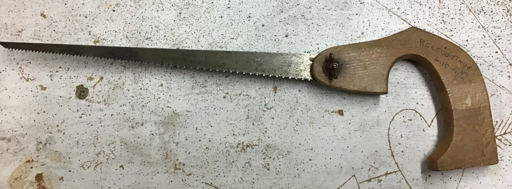

_Vintage keyhole saw_

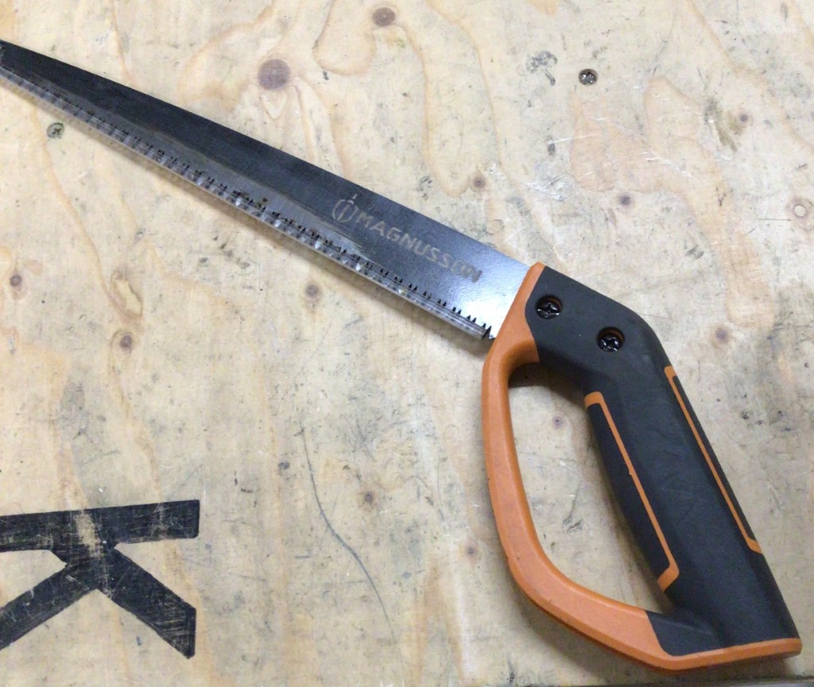

_Pruning saw_

## Back or rip / cross-cut saws

A back/rip saw is defined as one intended to cut along the grain, where-as a 
cross-cut saw cuts across the grain. Unfortunately the only way to classify them
easily is to look at the teeth.

Fortunately some saw types (like tenon saws), have their own classification and 
so the tooth type doesn't matter, but panel saws are a different beast.

### Looking at the teeth

Some general characteristics to look for:

| Back or rip cut                 | Cross cut                                    |
|---------------------------------|----------------------------------------------|
| Along the grain                 | Across the grain                             |
| Like a series of little chisels | Like a series of little knives               |
| Flat forward cutting face       | Sharpened forward and backward cutting faces |
| Asymmetric teeth                | Symmetric teeth                              |
| <= 7tpi (teeth per inch)        | \>= 7tpi (teeth per inch)                    |

Some examples of teeth, with guesses at the type:

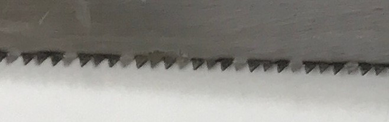

_Rip teeth: Vertical face, inline_

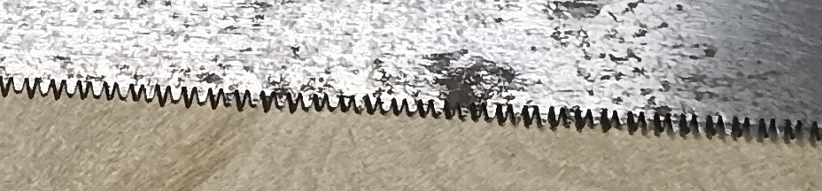

_Cross cut teeth: Finer, sharpened teeth, alternate sides, vertically symmetric_

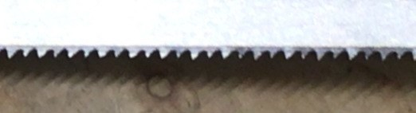

_Rip teeth? Small, but leading vertical edge, maybe worn?_

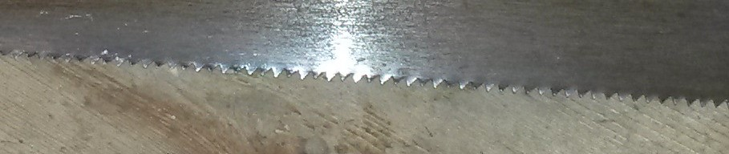

_Rip teeth? Small, alternating sides like cross-cut, but not symmetric_

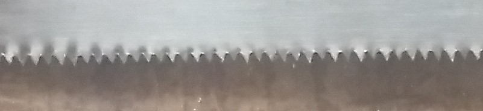

_Cross cut: Very fine, nearly symmetrical_

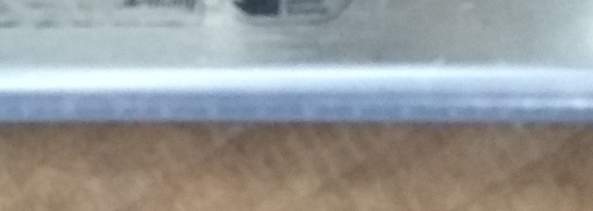

_Teeth hidden by cover: Who knows?_

### Back or rip saws

This is a "Panel Saw", but without looking at the teeth carefully we can't see if it's
a rip or cross cutting saw (or some type of hybrid).

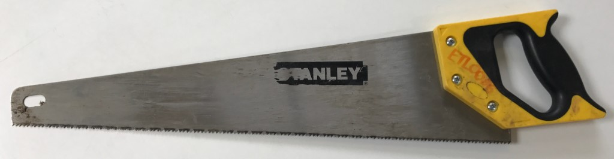

_Rip saw, or back saw_

### Cross cut saws

Here we have a nearly identical looking panel saw, but with different teeth, making this
a cross cut saw.

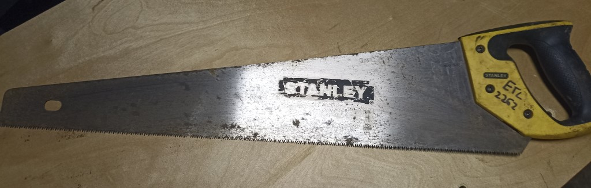

_Cross-cut panel saw_

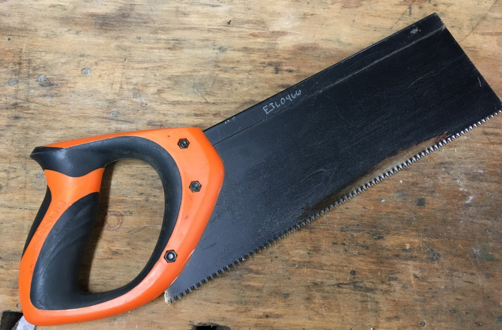

_Tennon saw_

Razor or fine saws can be rip as well as cross, but this one looks like a cross cut saw.

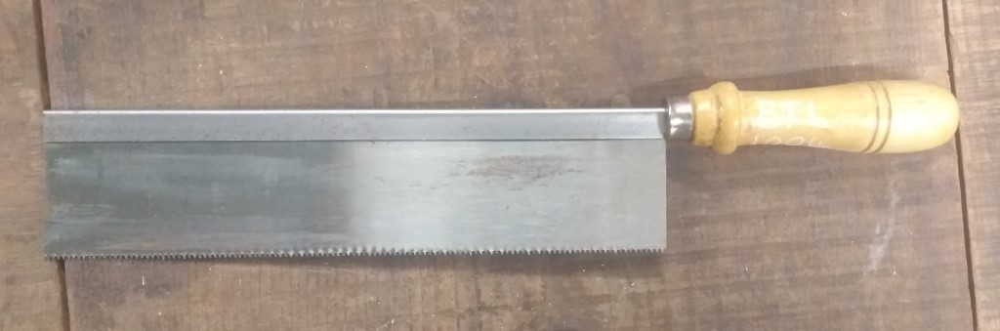

_A cross-cut razor saw, or fine saw_

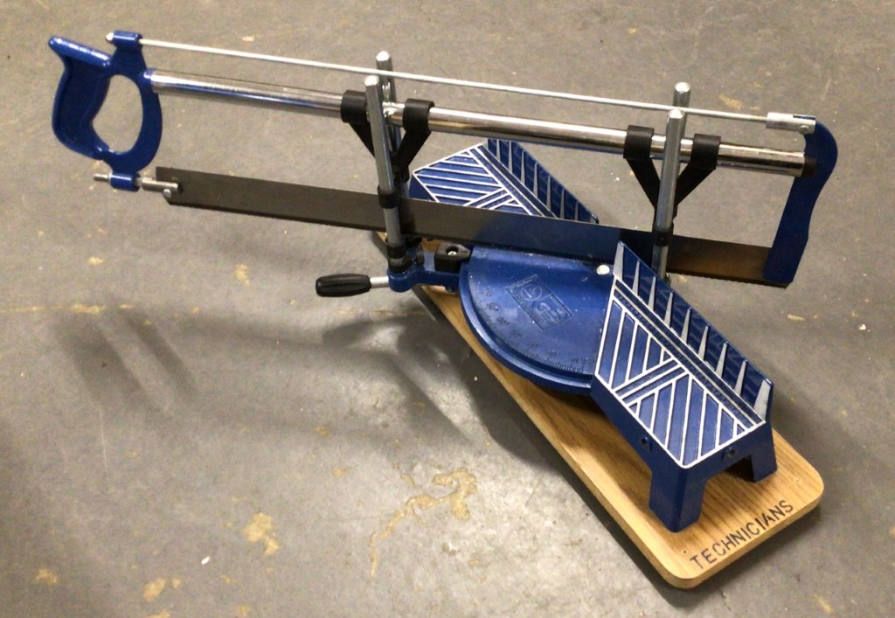

_Miter saw_

A Japanese pull saw with two sides like this is usually both, with larger
teeth on one side for ripping and finer teeth for cross cutting on the other.

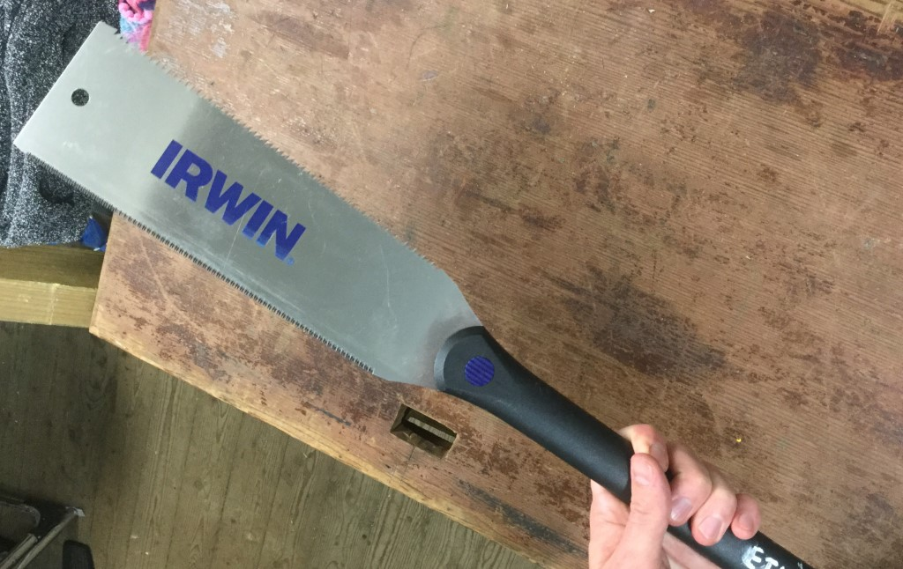

_Japanese pull saw_

Throwing all the tooth guidance out the window, antique cross-cut saws often have
bonkers tooth patterns.

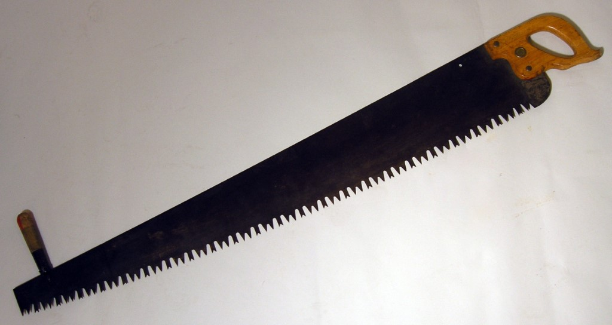

_Vintage cross-cut saw_

