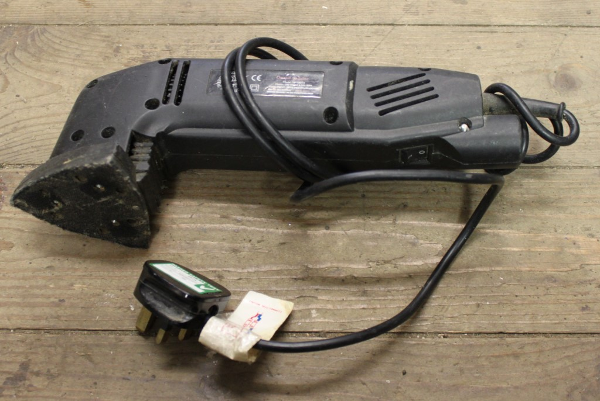
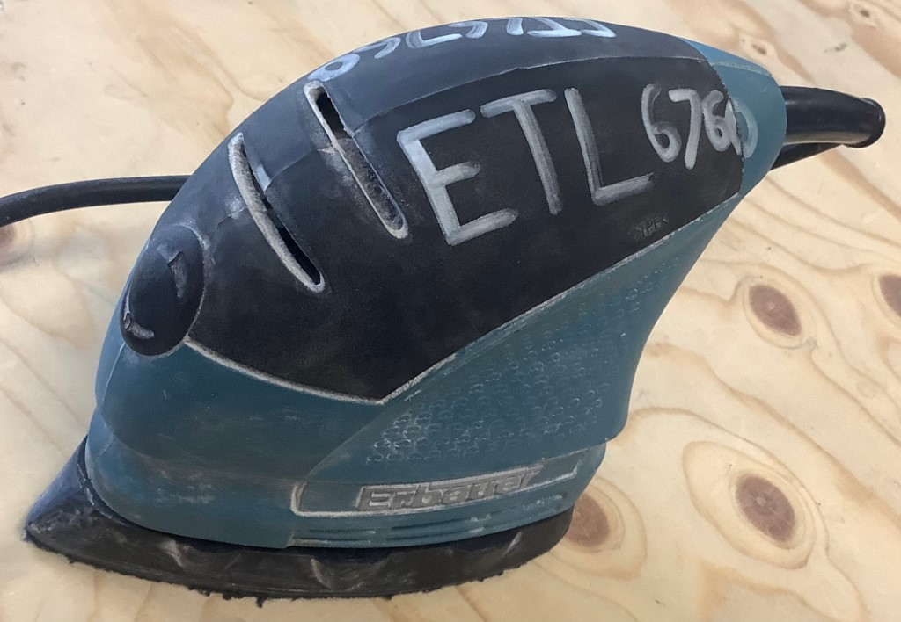
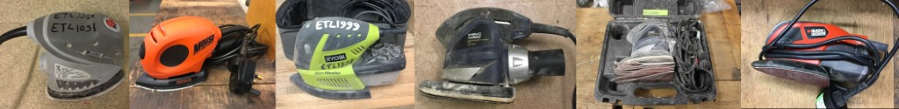
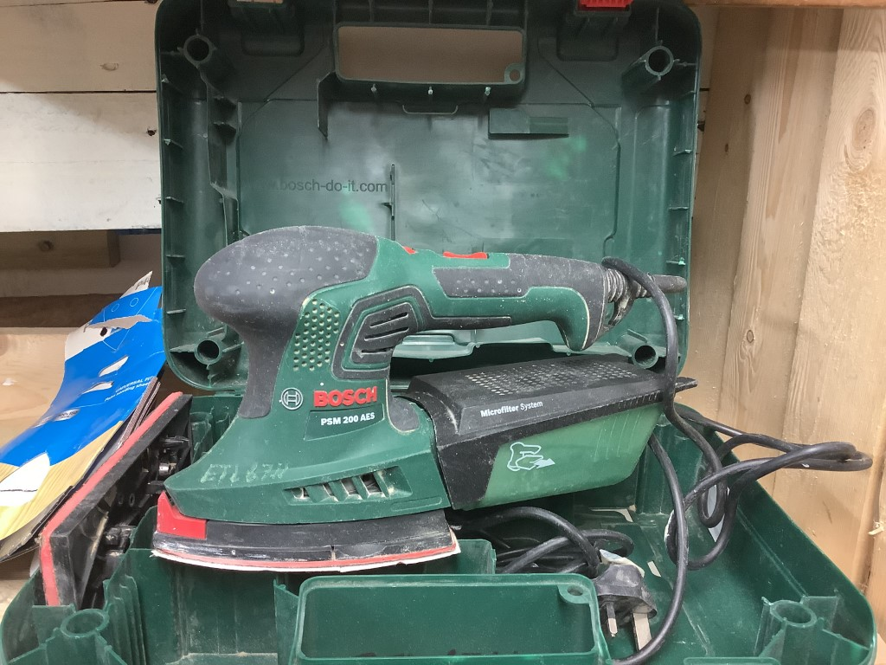
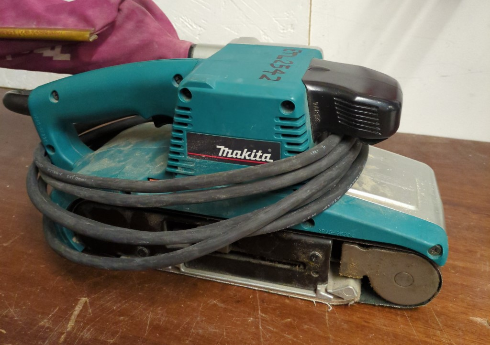
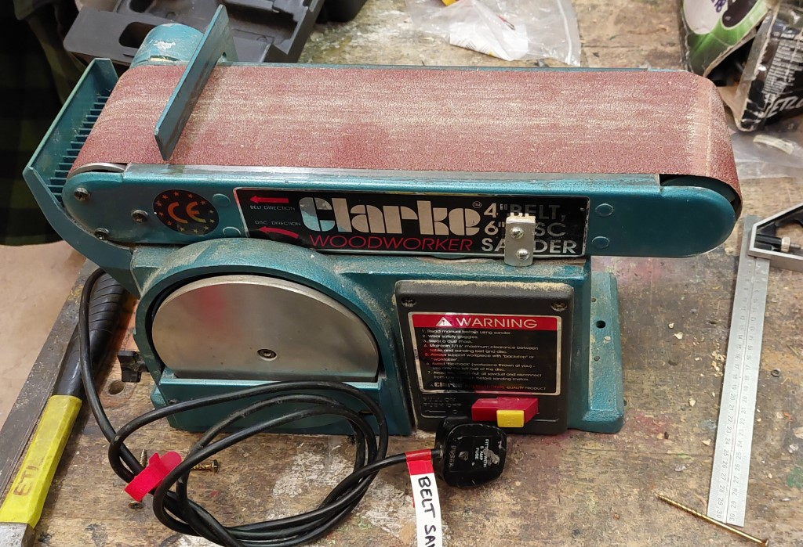
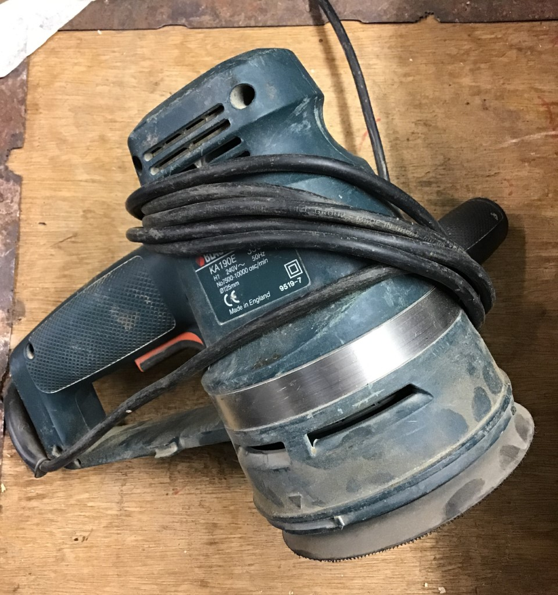
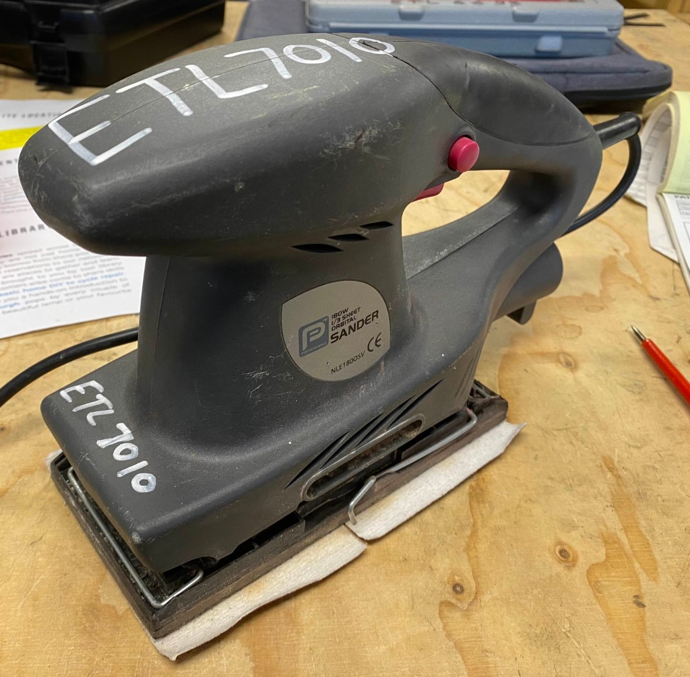
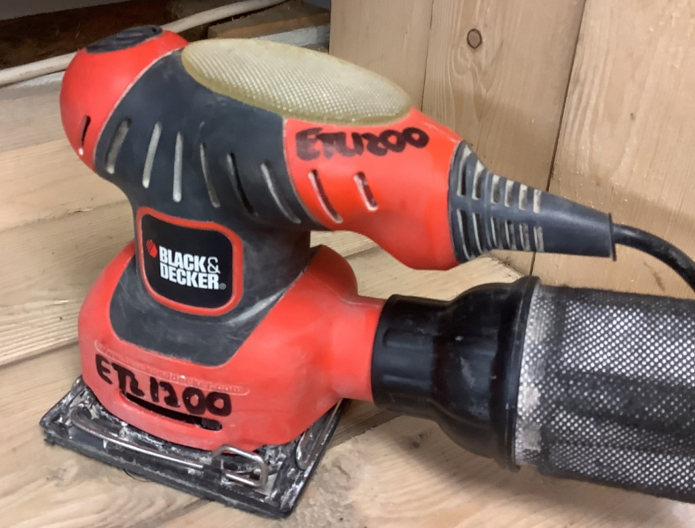

# Power Sanders

[Home](README.md)

## Detail / Mouse Sanders

Detail sanders have a pointy nose to get into corners.

_Detail sander_

Some are very dinky and held in the palm and are called "Mouse Sanders" for obvious reasons:

_Mouse sander_

Technically a Mouse Sander is a Detail Sander, but we classify them separately. They come in quite
a few different flavours:

_Examples of different mouse sanders_

Even if these are bigger or smaller they are held in the palm, and have a sharp nose. The
detail sanders have a longer body, and usually smaller actual sanding pads (for more _detail_!).

Some fall into a confusing category when looking at the body, with features of both, but the 
large triangular sanding area ironically makes this a mouse sander. 

_Mouse sander with pistol grip_

## Belt Sanders

A belt sander takes a sanding belt, but is generally hand-held or bench top.
For categorization purposes, both are "Belt Sanders", but we mostly mean the
hand held type when we say it.

_Handheld belt sander_

Most benchtop sanders also have an attached disc sander, so we'd call
this a combination or "Combi Sander" for categorization purposes.

_Benchtop belt sander_

## Orbital Sanders

Orbital sanders are an annoying category. The orbital refers to the motion of the
sanding surface moving in a roughly circular pattern. The "randomness" introduces
wiggles to the pattern intended to prevent scratching the circular pattern into whatever
you are sanding.

Not all orbital sanders are "random", and you can't tell by looking at them.

The classic "Random Orbital Sander" is round at the end and takes sanding 
discs which attach with velcro.

_Random orbital sander_

They can also take sand paper sheets, where you might seem them called
"Sheet Sanders" or "Finishing Sanders", while technically being orbital too.

_Finishing sander, or sheet sander... also orbital!_

"Palm sanders" are similar to finishing sanders, but use smaller sheets (e.g. 1/4 
of a sheet) and are held from the top, instead of a pistol grip are also orbital.

_Palm sander_
