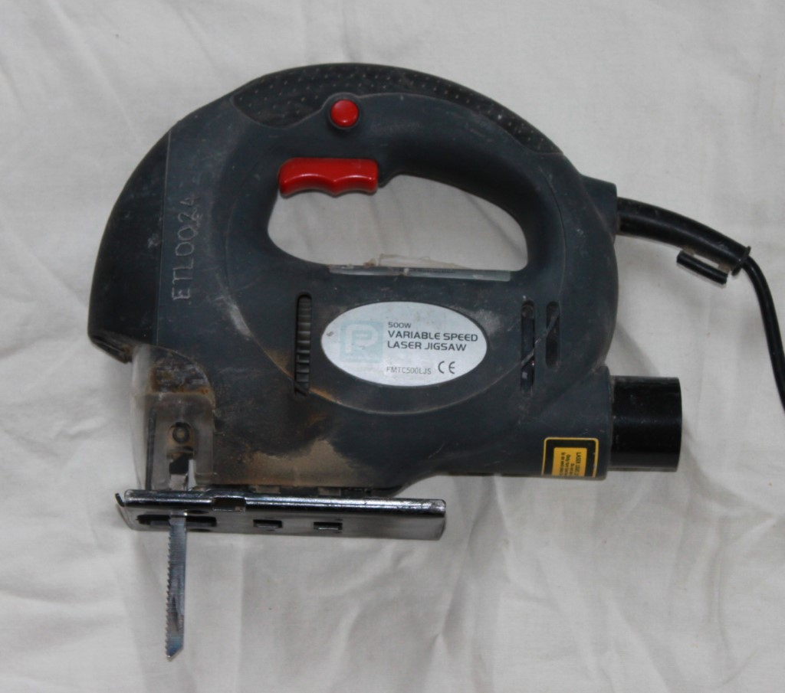
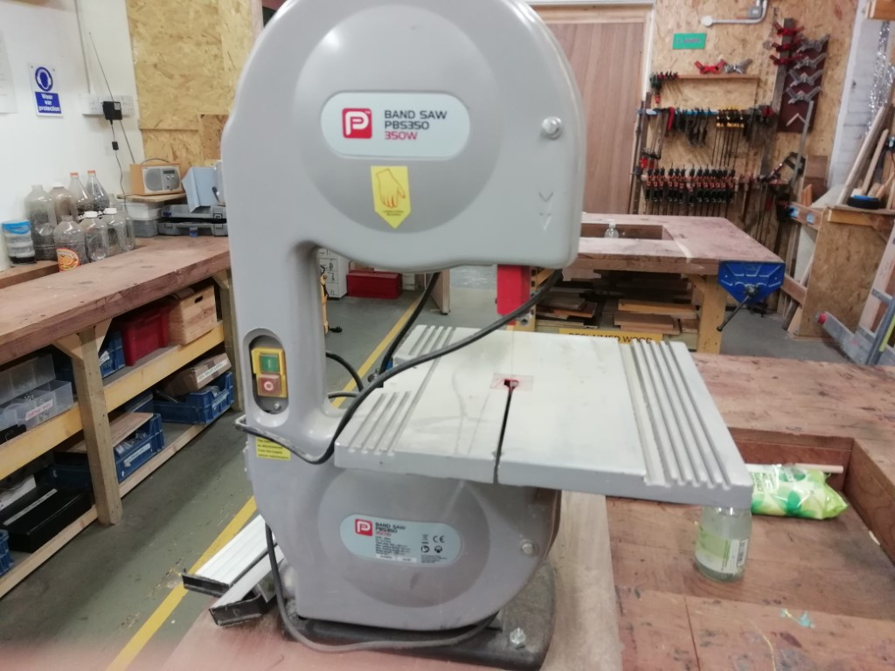
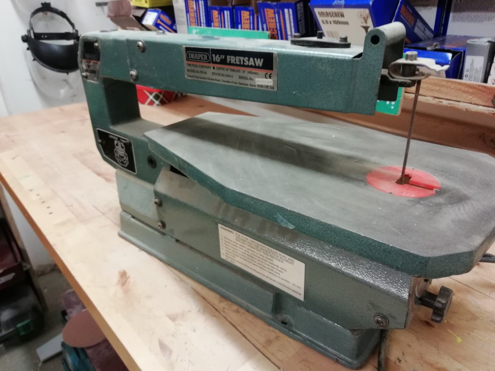
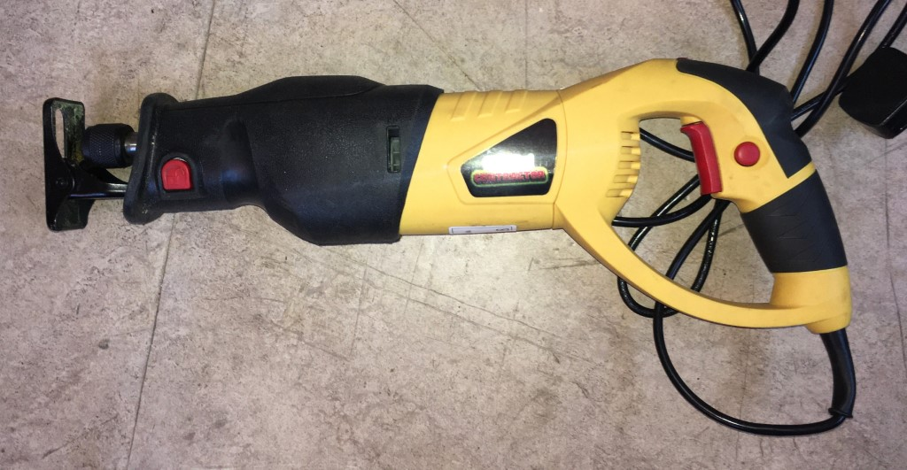
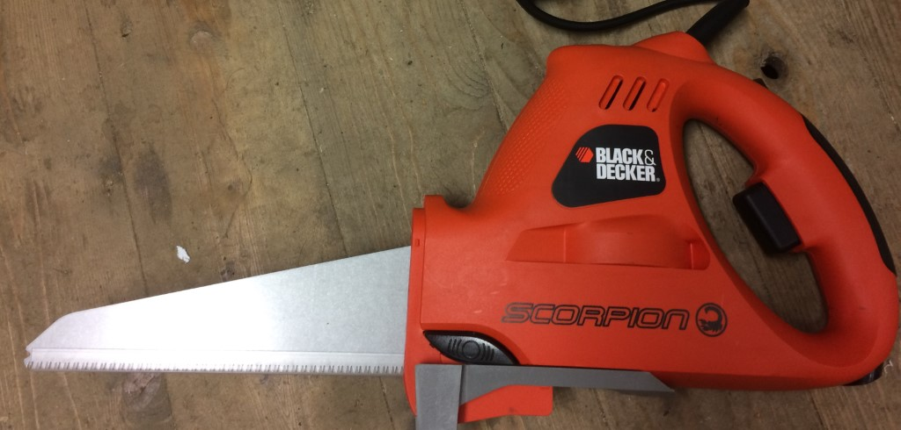

# Power Saws

[Home](index.md)

## Circular blades

Lots of power saws have [circular blades, and are therefore some variety of circular saw](power_saws_circular.md).

## Vertical blades

The most common vertical saw is the "Jigsaw" with a small oscillating vertical blade.

_Jigsaw_

"Band saws" have a continuous blade that runs all the way through it and ranges from the
large to the absolutely enormous.

_Mini benchtop band saw_

Looking a bit like a band saw a "Scroll Saw" has a vertical blade, but it also oscillates
like a jigsaw, but fixed to a platform.

_Scroll saw, or fret saw_

## Reciprocating saws

If the whole blade goes back and forth, like a jigsaw on a stick, then it's 
a "Reciprocating saw".

_Reciprocating saw_

A kind of huge turkey carving type of affair is also a reciprocating saw, but goes by a few
different names like"

_Power saw, alligator saw or multi-function saw_
