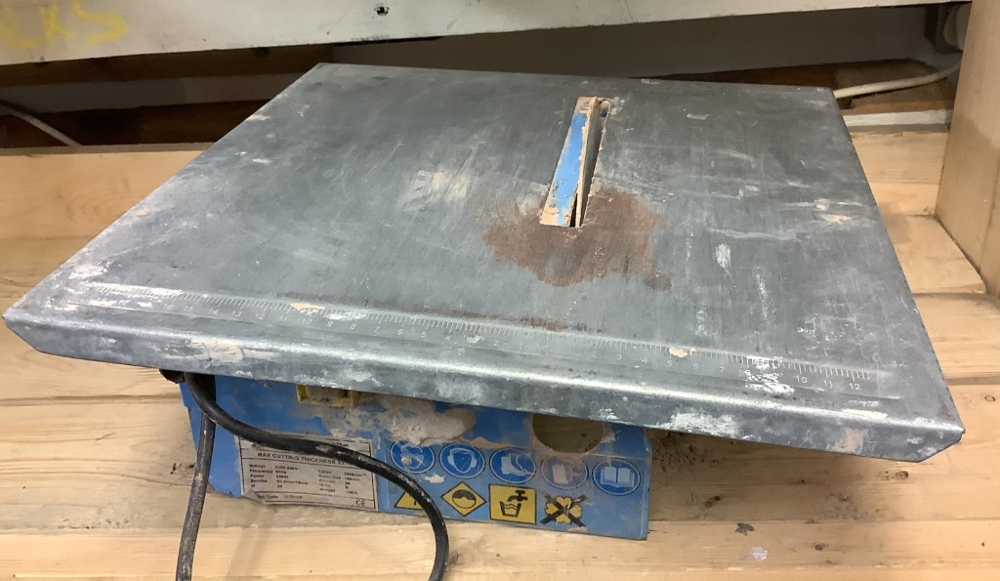

# Power Saws (Circular)

[Home](README.md)

## Circular / Track / Table Saws

### Circular Saws

Plain "Circular Saws" usually refers to the hand held mobile type:

_Circular saw_

If it runs along a track it's a "Track Saw". Sometimes called a Plunge or Rail saw.

_Track saw, or. plunge / rail saw_

If the saw blade sticks up out of a table, it's a "Table Saw".

_Site table saw_

Unless it's teeny tiny (and possibly absolutely filthy) in which case it might be
a "Wet Tile Saw".

_Wet tile saw_

## Mitre Saws

Circular saw on a plate with various features:

_Sliding compound mitre saw, with distinguishing features highlighted_

1. Mitre - If the tool can pivot when viewed from above
2. Compound - If the tool can pivot when viewed from the front
3. Sliding - Kind of obvious, if it slides back and forth

⚠️ Mitre saws are often called "chop saws" informally, but true chop saws cannot
alter the angle when viewed from above.

If you only have some of the features, say Mitre + Compound, then it's a
"Compound Mitre Saw". It seems they generally drop features in a predictable
way:

 * Sliding Compound Mitre Saw
 * Compound Mitre Saw
 * Mitre Saw

I've not seen any where it slides, but doesn't tilt say.

⚠️ We also have some hand mitre saws, so watch out for misclassification here:

_Hand mitre saw, reporting in to mess up your metadata_

# Radial Arm / Chop Saws

If it basically looks like a Mitre Saw but only goes up and down, it's probably a 
"Chop Saw".We don't really seem to have any of these, so chances are it's some 
variety of mitre saw. 

_Chop saw, or cut-off saw_

Another thing we don't seem to have is "Radial Arm Chop Saws"

_Radial arm chop saw_

These guys run along an overhead arm, which is different from the tube based
sliding mitre saws.