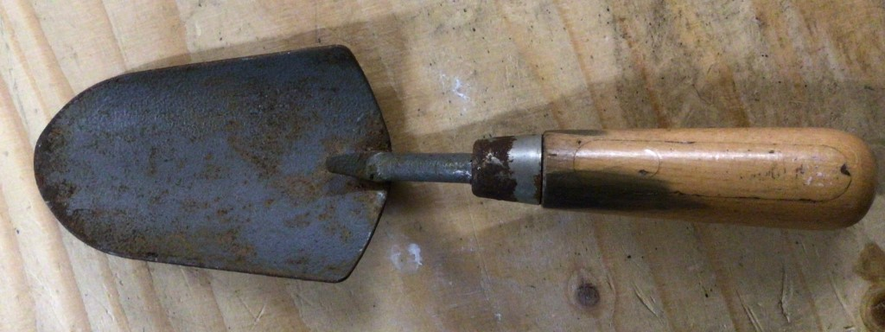
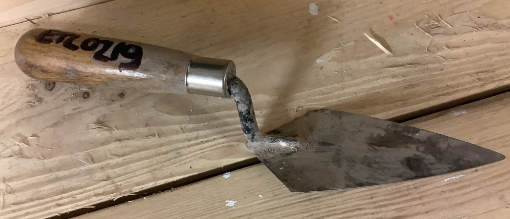
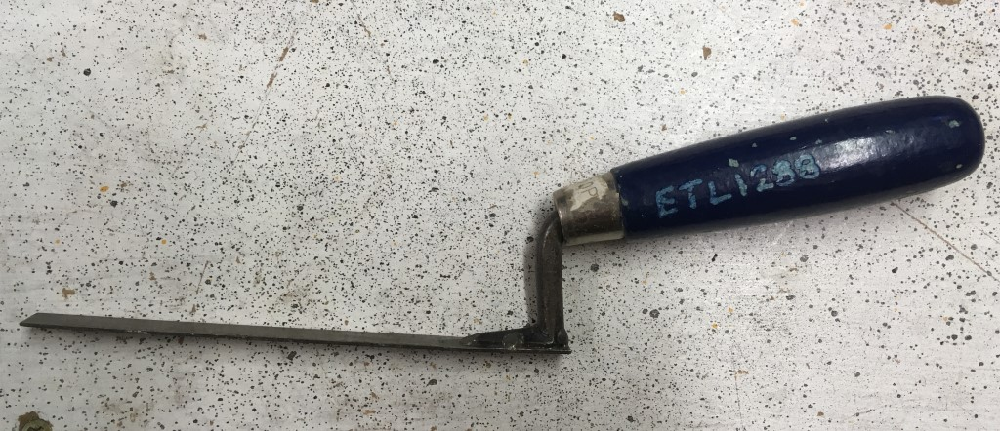
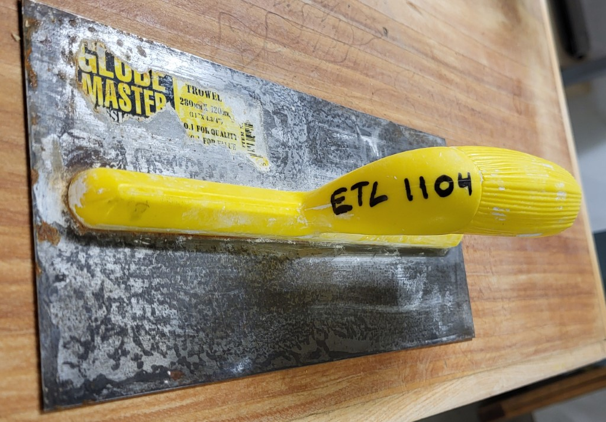
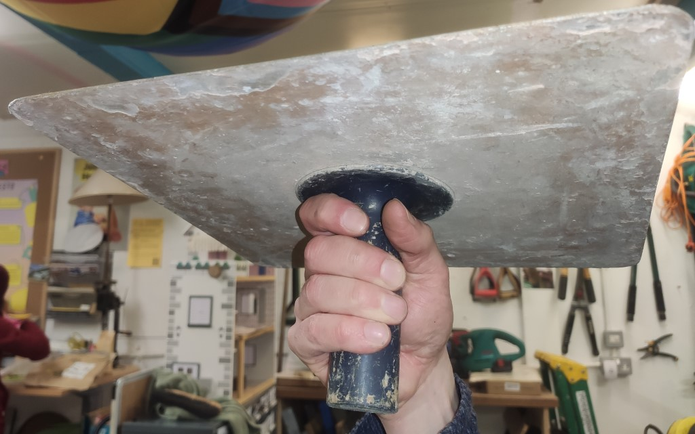

# Trowels

[Home](README.md)

_Garden trowel_

_Brick trowel, cement trowel or pointing trowel_

_Tuck point trowel_

_Float trowel_

_Notched trowel, or tiling trowel_

⚠ Watch out for "Mason's Hawks", which are held handle down for mixing:

_Mason's Hawk_